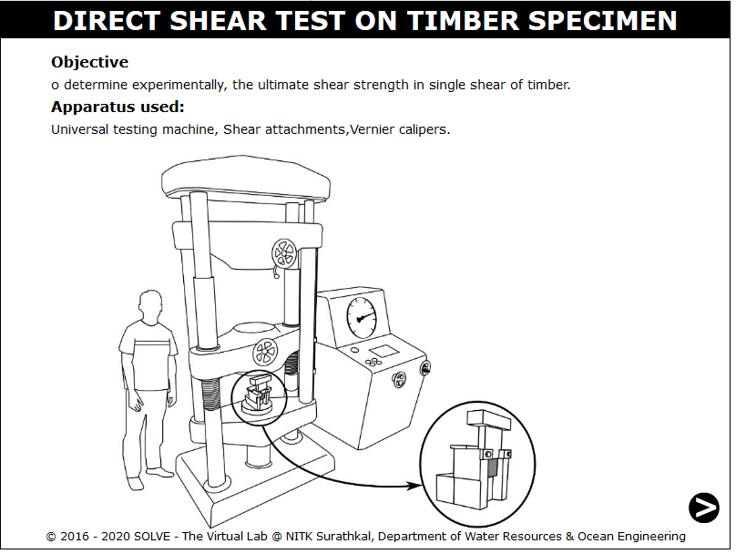
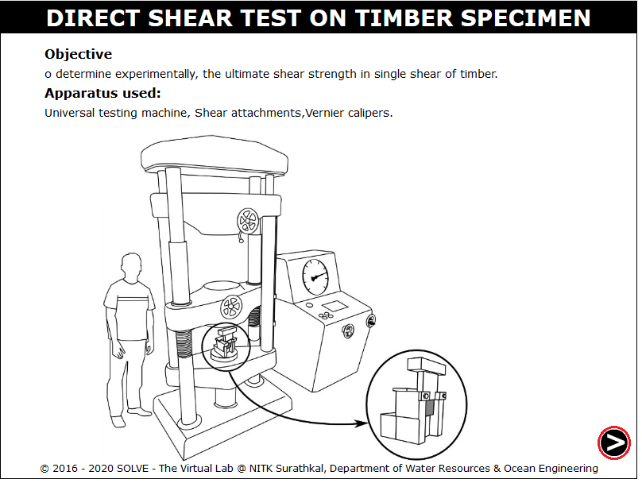
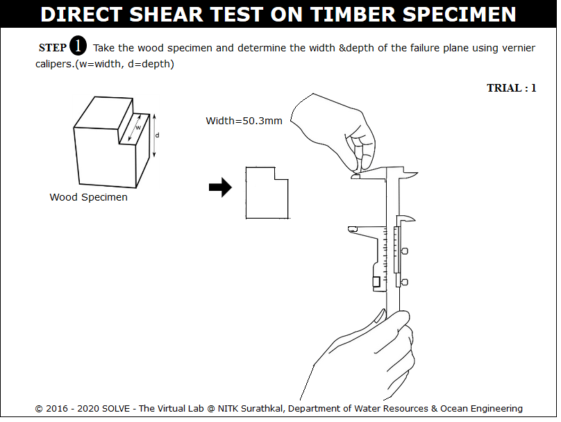
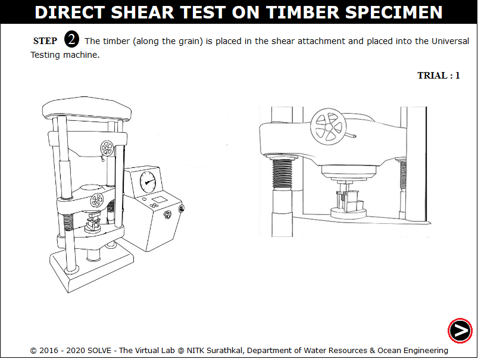
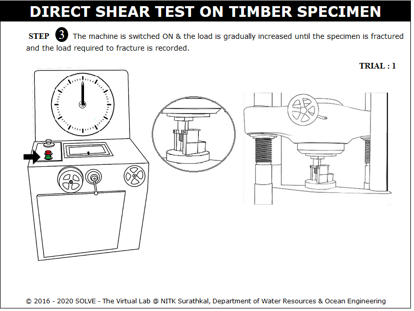
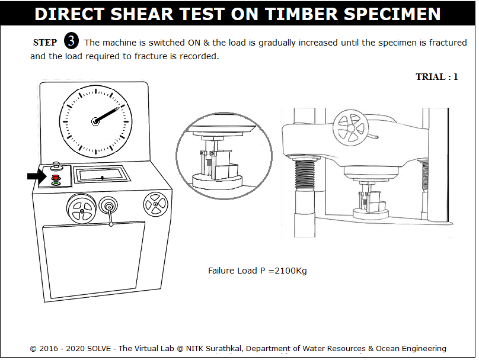
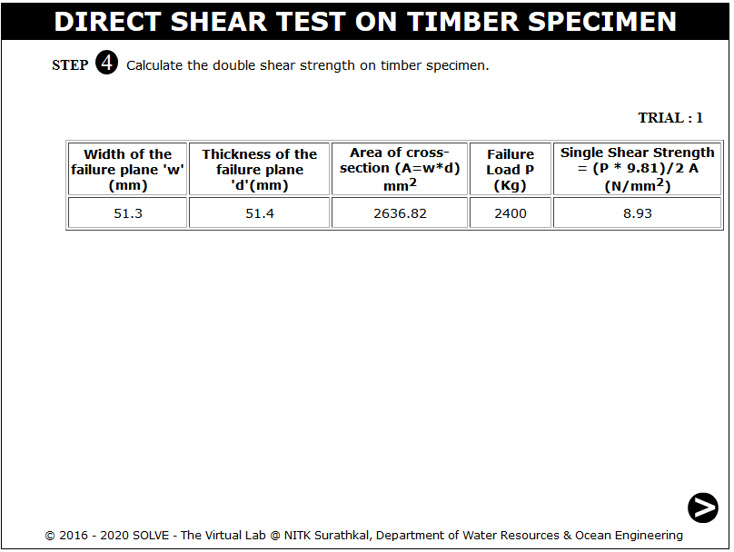
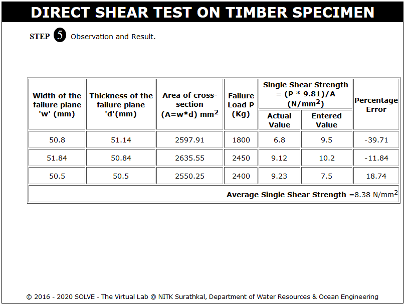

**OBJECTIVE**:

To determine experimentally, the ultimate shear strength of timber.

**STEPS**:

1. Click on the direct shear test on timber file , a window will open as shown below.  
   

2. Click on the NEXT button to move to the next step.  
   

3. Here the width and depth of the specimen is determined, then click on NEXT button to see the placing of the test set up.  
   

4. After placing the specimen in UTM move to next step by clicking on the NEXT button.  
   

5. Switch on the machine and apply load gradually.  
   

6. Load is applied till failure of the specimen and the machine is switched off.  
   

7. The double shear strength on mild steel plate is shown in the tabular column.  
   

8. Same step is repeated for different trails.  
   
