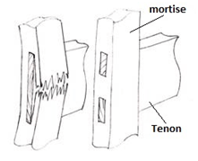
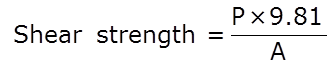
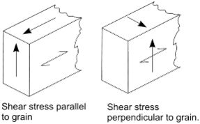
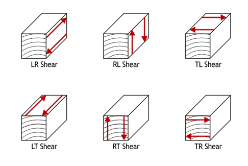
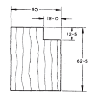

Knowledge of shear failure is important while designing any structures or components. Whenever forces act upon a body in such a way that one portion tends to slide upon another adjacent to it the action is called a shear. In wood this shearing action may be along the grain, or across the grain. A tenon breaking out its mortise is a familiar example of shear along the grain, while the shoving off of the tenon itself would be shear across the grain.

Knowledge of shear parallel to the grain is important, since wood frequently fails in that way. The value of shearing stress parallel to the grain is found by dividing the maximum load by the area of the cross section.

The shear test shall be carried out on a suitable testing machine with the help of a shearing tool in a rig. The specimen shall be not to be shared off rests on the support throughout the test. The shearing tool shall rest on the notch. The direction of shearing shall be parallel to the longitudinal direction.

The ratio of stress to strain in shear is known as the modulus of rigidity, or shear modulus. Shear failure may coincide with one of these planes; hence, six distinct modes of shear failure are possible: LR, RL TL, LT, RT, and TR.M

Collectively, RT and TR shear are sometimes called rolling shear; Rolling shear is defined as shear stress leading to shear strains in a plane perpendicular to the grain direction. Due to the very low rolling shear stiffness of timber significant shear deformations may occur.

LR and LT shear are the two kinds of longitudinal shear. Wood is generally more resistant to longitudinal shear than rolling shear; however, longitudinal shear is a common failure mode in an overloaded beam. This longitudinal shear is maximum at the neutral plane and decreases toward the upper and lower surfaces.
Finally, RL and TL shear are the two kinds of transverse shear. Except for certain brittle softwoods, like western red cedar, wood very rarely fails in transverse shear, it will undergo tensile failure first.

**TEST SPECIMEN**:

The specimens are usually in the form of small, clear, straight-grained blocks with a projecting tenon or lip to be sheared off.Two common forms and sizes are shown in figure. Part of the blocks is cut so that the shearing surface is parallel to the growth rings, or tangential; others at right angles to the growth rings, or radial. It is important that the upper surface of the tenon or lip be sawed exactly parallel to the base of the block. When the form with a tenon is used the undercut is extended a short distance horizontally into the block to prevent any compression from below. The standard test specimen shall be 5 X 5 cm in cross-section and 6 cm in length or 2 X 2 cm in cross-section and 3 cm in length. The specimens shall be notched on one end to produce shear failure on 5 X 5 cm or 2 X 2 cm surface in the radial or tangential plane.

**RELEVANT INDIAN STANDARD FOR DIRECT SHEAR TEST**:

1. IS 1708-(part 11)- Methods of testing of small clear specimens of timber.
